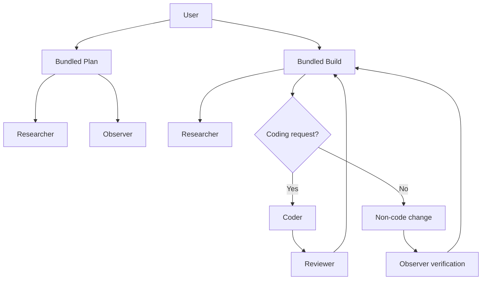

# opencode-dev-kit

Reusable OpenCode agents and skills for planning, investigation, implementation, review, and operational verification.

## How it works

The kit bundles `plan` and `build` as primary entry points that override OpenCode's built-in agents when installed. Planning delegates evidence gathering to `researcher` and `observer`. Build delegates clarification and verification to `researcher` and `observer`, repository changes to `coder`, and coding review to `reviewer`.



Coding work flows through `coder` and then `reviewer`. Non-coding work ends with `observer` verification. When information is missing, plan and build ask both `researcher` and `observer` what to inspect before proceeding. An unexplained failure returns to the primary plan agent for evidence-backed investigation instead of guessing.

## Operating principles

- Keep planning, research, observation, implementation, review, and coordination separate.
- Read before changing state and use the least-powerful suitable tool.
- Safety, explicit scope, and verified evidence take priority over speed; failures, missing credentials, inaccessible targets, and absent results are not success.
- Distinguish facts, evidence-backed inferences, assumptions, hypotheses, and unknowns.
- Give delegated work an objective, scope, constraints, evidence requirements, and stop conditions. Run independent work in parallel, serialize dependent or overlapping changes, and preserve a rollback path where applicable.
- Keep one bounded objective per session and pass concise summaries rather than raw logs or transcripts.

## Install

`install.py` links bundled agents and skills, plus selected plugins, into a project's `.opencode/` directory. Bundled agents and skills are selected by default; this repository has no bundled `plugins/` directory, so plugins require an explicit source.

```shell
./install.py
./install.py --target /path/to/project
./install.py --dry-run --target /path/to/project
```

`--target` accepts a project directory or an explicit `.opencode` directory. The installer creates relative links for bundled content and links remote content from `.opencode/.install-cache/`. A correct existing link is retained.

### External sources

The repeatable singular/plural flags select one item or a collection:

```text
--skill SOURCE       --skills [SOURCE]
--agent SOURCE       --agents [SOURCE]
--plugin SOURCE      --plugins [SOURCE]
```

Local paths, HTTP(S) URLs, and GitHub repository-tree URLs are supported. A no-value plural flag explicitly selects its bundled collection; no flags select bundled agents and skills. A single skill directory must contain a direct `SKILL.md`; a skill collection contains child directories with direct `SKILL.md` files. Files below a skill directory, including references, are retained.

For example:

```shell
./install.py --skill /path/to/one-skill
./install.py --skills https://example.test/skills/
./install.py --skills https://github.com/example/project/tree/main/skills
```

HTTP is supported but prints a warning; prefer HTTPS. Treat remote agent and skill prompts as executable policy: use trusted sources and review the `--dry-run` output. Plugins are JavaScript that execute when OpenCode starts; remote plugins are warned about, cached before linking, and never executed by the installer. Review plugin source before installation.

### Config, providers, and profiles

Use `--config [PATH]` to merge `skills`, `agents`, and `plugins` source lists plus OpenCode settings. Without a path it loads `./config.json`; relative paths inside the file resolve beside that file. Use [`sample_config.json`](sample_config.json) as the provider/model template instead of copying configuration into this document:

```shell
cp sample_config.json config.json
./install.py --config config.json --profile profile1
```

`model-aliases` are user-defined names that point to canonical `provider/model-id` values and optional variants. `agent-models` maps bundled delegated agents — `coder`, `researcher`, `observer`, and `reviewer` — through those aliases, canonical IDs, or per-agent overrides. Primary `plan` and `build` models are managed manually in the runtime configuration, and `--profile` rejects assignments for those primary names. Provider and model objects are deep-merged by ID: supplied fields override existing fields while unspecified fields and existing providers remain. The installer maps `opencode_json.providers` to the runtime `provider` key. Use environment-based credential interpolation or a credential-injecting plugin; never commit secrets to the config.

`--profile NAME` requires the explicit `--config` option. If its optional path is omitted, `--config` loads `./config.json`; without `--profile`, content installs normally and existing agent routing is unchanged. Config sources are processed before command-line sources; exact duplicates are deduplicated, differing same-name content fails before the target changes, and bundled content wins a name conflict.

### Repeat runs and restart

Unrelated existing content is left alone. Wrong or broken links are replaced; existing real files or directories are backed up under `.opencode/.install-backups/<timestamp>/` before replacement. If installation fails, new links are removed and non-symlink backups are restored.

`--dry-run` resolves, downloads, validates, and displays the plan without creating the target, cache entries, links, backups, or state. Quit and restart OpenCode after installation because configuration-time files are not hot-reloaded.

## Use

The installed `plan` and `build` modes are the Tab-selectable primary agents. Use them directly:

```text
Plan mode:
Describe the implementation plan or investigation needed.

Build mode:
Provide the approved plan text or an exact saved plan path.
```

`approved` is not a special OpenCode control token. Pass the approved plan text or an exact saved plan path; the build session should not be expected to inherit the complete planning transcript. When more information is needed, plan delegates to both `researcher` and `observer` with specific questions and evidence requirements. Build uses the same clarification gate before implementation or operational action. Build delegates repository changes to `coder`, coding review to `reviewer`, and post-change verification to `observer`. Unknown root causes are handed back to plan for evidence-backed investigation rather than guessed.

## Agents, skills, and validation

### Inventory

| Component | Role and boundary |
| --- | --- |
| Bundled `plan` / `build` | Primary planning and execution modes that override OpenCode built-ins. Their models are managed manually. |
| `researcher` | Read-only local/public documentation research with cited findings; never runs shell commands or delegates. |
| `observer` | Read-only state, log, and outcome verification; cannot edit or delegate. Unknown operational tools require an explicitly audited read-only allowlist. |
| `coder` | Implements delegated repository changes using `code-philosophy`. |
| `reviewer` | Reviews completed changes without editing or running shell commands, using `code-philosophy`. |
| `code-philosophy` | Baseline for correct, secure, testable, maintainable implementation and review. |
| `summarize-investigation` | Evidence-based investigation report skill for timelines, findings, root cause, and remediation. |

### Validate

Run the core checks after installation:

```shell
opencode agent list
opencode debug config
opencode models
python3 -m unittest discover -s tests -v
```

Confirm that:

- Installed `plan` and `build` are primary, with `researcher`, `observer`, `coder`, and `reviewer` available as delegated agents.
- Plan and build ask `researcher` and `observer` for targeted evidence when clarification is needed; build delegates repository edits to `coder`, and `observer` and `reviewer` remain read-only.
- Permission rules match the inventory: content searches may require approval because sensitive paths cannot be excluded from `grep` results.
- Observer outcomes use `PASS`, `WARN`, `FAIL`, `ERROR`, or `CANNOT VERIFY`; tool and credential failures are not healthy results.
- Selected plugins appear as symlinks under `.opencode/plugins/` and are not executed by the installer.

## Sessions

Keep one bounded objective per session. Use a concise handoff and a fresh session when changing to an unrelated objective or moving from investigation into implementation; this prevents stale assumptions and raw evidence from crowding execution context.
